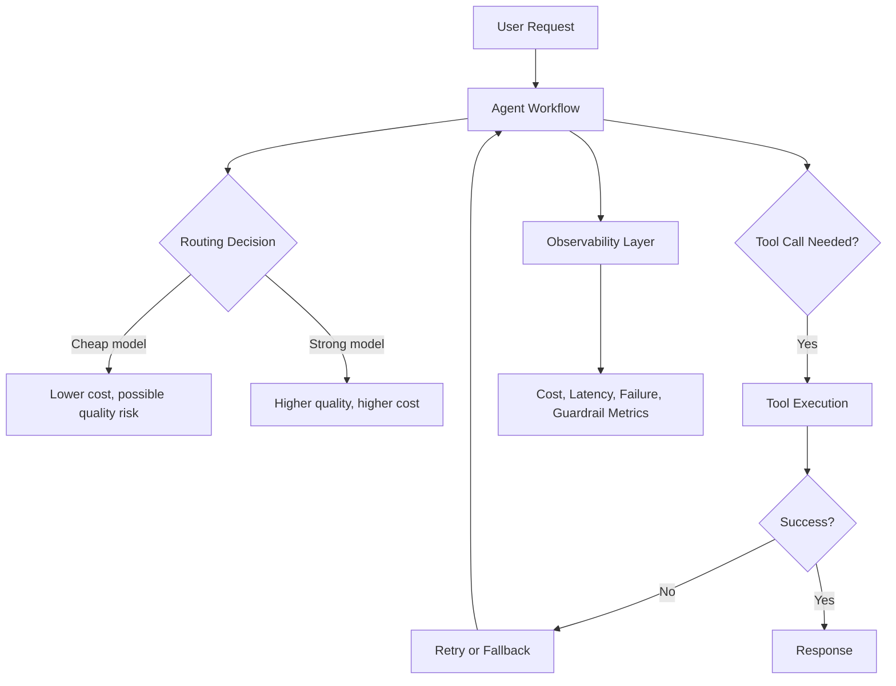

TL;DR

- Agent systems do not only fail because the model gives a weak answer.
- They fail because workflows loop, retries hide problems, costs compound, and routing choices add latency.
- `agentops-simulator` is a simulation-first project for making those tradeoffs visible before real providers and real bills enter the room.
- It models routing, cost, latency, retries, guardrails, traces, evaluation signals, and production-readiness style scoring.
- The point is not to predict the future perfectly. The point is to make operational tradeoffs impossible to ignore.

## The problem

Agent workflows look tidy in diagrams.

A user asks for something. The agent plans. It chooses a model. Maybe it calls a tool. Maybe it retries. Maybe it falls back. Eventually, something returns a response and everyone claps politely.

Then production happens.

The cheap model fails on the step where accuracy matters. The premium model is used for every tiny classification task. A retry policy quietly triples the cost of a workflow. A fallback saves the user experience but hides the failure rate. A tool call times out, the agent tries again, and the dashboard starts developing a personality.

Agent systems do not fail only because the model gives a bad answer. They fail because workflows loop, costs compound, retries hide failure, routing decisions add latency, and nobody notices until the dashboard looks like it was attacked by a raccoon.

That is the world `agentops-simulator` is built to explore.

## Why this matters

Token cost is not just a finance problem.

It is architecture feedback.

If a workflow is expensive, slow, and unreliable, the bill is not the only issue. The cost is telling you something about the shape of the system. Maybe the router is choosing the wrong model. Maybe caching should exist. Maybe retries are masking a bad prompt. Maybe a tool should not be called until a cheaper classifier confirms it is needed.

Those are design questions, not invoice questions.

The hard part is that teams often discover them late. A demo can hide cost. A prototype can hide retries. A happy-path trace can hide the messy parts of execution. By the time the system is connected to real users, real tools, and real model providers, the tradeoffs are harder to change.

The simulator exists so those conversations can happen earlier.

## What I built

[`agentops-simulator`](https://github.com/revanthpp/agentops-simulator) is an open-source, production-style sandbox for understanding the economics and reliability tradeoffs of LLM and agentic workflows.

It simulates AI workflows from YAML definitions. A run can include retrieval, model calls, tool steps, cache behavior, retries, fallback decisions, guardrail checks, evaluation signals, and trace events. It also includes model profiles for premium, reasoning, open-source, cheaper, and local-placeholder models.

The project includes:

- Workflow simulation
- Cost-aware routing strategies
- Token, model, tool, retry, wasted-call, and cache-savings accounting
- Guardrail placeholders for PII, prompt injection, unsafe tools, token limits, budgets, and loop risk
- Evaluation signals for task success, completeness, groundedness, tool correctness, cost efficiency, and latency
- OpenTelemetry-shaped trace events
- FastAPI API
- Typer CLI
- Streamlit dashboard
- SQLite persistence
- Tests, Docker, Docker Compose, Makefile, and docs

It is a simulator and reference project, not a production operations platform. That distinction matters. The goal is to make the shape of the operating problem visible.

## How the simulator thinks about agent workflows

At a high level, the simulator treats each workflow as a series of decisions.

A workflow step can require certain capabilities, such as tool support, JSON mode, or a long context window. The router then selects a compatible model based on a strategy: cheapest, fastest, highest quality, balanced, task-based, budget-constrained, or premium-only.

That decision is not treated as magic. It is recorded with cost, latency, routing explanation, failures, guardrail signals, and evaluation output.

This is the part I care about most: the simulator makes the hidden parts of agent execution visible enough to argue with.

## The tradeoffs it makes visible

The first tradeoff is model quality versus unit economics.

Using the strongest model everywhere is simple, but it can be wasteful. Using the cheapest model everywhere is also simple, but it can create retry storms, weak outputs, and quality failures that cost more in the end.

The second tradeoff is retry behavior.

Retries feel like reliability until you realize they can hide poor design. A system that succeeds on the third attempt may look healthy from the outside while quietly burning latency, tokens, and user patience.

The third tradeoff is caching.

Cache hits are not glamorous. They are also one of the simplest ways to avoid repeating expensive work. The simulator tracks estimated cache savings so the architecture impact is visible.

The fourth tradeoff is observability timing.

Observability added after launch is usually archaeology. You are digging through traces, logs, and user complaints trying to reconstruct what the system should have told you in the first place.

Agent workflows need observability early because the failure modes are not always obvious. A single bad answer is easy to spot. A routing policy that creates slow, expensive, flaky behavior across thousands of runs is harder.

## What this taught me

The main lesson is that agent operations are system operations.

The model matters, obviously. But once the workflow has routing, tools, retries, fallback behavior, budgets, guardrails, caching, and evaluation, the model is only one part of the story.

The architecture decides whether the system is understandable.

The simulator also reinforces a practical point: cost and reliability should be evaluated together. Cheap but flaky can become expensive. Premium but overused can become lazy architecture. Fast but underpowered can create downstream cleanup work. Good routing is not about worshipping one model. It is about matching the step to the constraint.

That is a useful muscle to build before a workflow touches production.

## What comes next

The project already includes the simulation core, API, CLI, dashboard, guardrail placeholders, traces, cost model, and evaluation scoring.

The natural next steps are:

- Real provider adapters with typed request and response mapping
- OpenTelemetry span export
- Persistent aggregate dashboard metrics
- Deterministic experiment fixtures
- Vector-store-backed RAG simulation
- Tenant budgets and policy enforcement
- HTML or PDF reports for architecture reviews
- Red-team and synthetic eval generation

Those are roadmap items, not claims about the current MVP.

## Final thought

Agent workflows need the same operational respect we give other distributed systems.

They need budgets. They need traces. They need failure taxonomy. They need routing discipline. They need guardrails. They need evaluation that catches more than the happy path.

The model may be the exciting part. The operating model is where the system becomes real.

