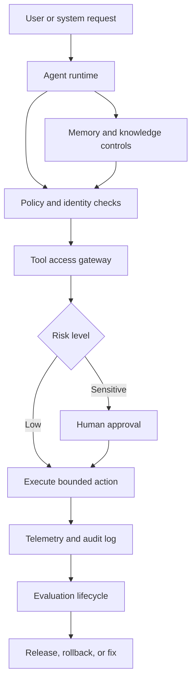

TL;DR

- Most agent demos stop before the production part gets interesting.
- A real agent platform is not one agent with a heroic prompt. It is a control system around agent behavior.
- `agents-with-brakes` defines the platform pieces: policy, identity, tool access, approvals, evals, observability, memory, knowledge boundaries, cost control, rollback paths, and failure management.
- The repo contains architecture docs, diagrams, component contracts, ADRs, a threat model, an eval lifecycle, an observability model, and a project map.
- The point is system-level applied AI architecture judgment, not another tool-loop demo wearing a tiny hard hat.

## The problem

Agent demos are usually built for applause.

The agent plans. The agent calls a tool. The agent writes a summary. Maybe it updates a fake ticket or books a fake meeting. Everyone nods at the smoothness of it all, and then the demo ends exactly where the real architecture begins.

Production does not care that the demo was charming.

Production wants to know who authorized the action, which tools were available, what data the agent saw, whether the output passed evals, how much the run cost, where the trace is, what happens on failure, who approves sensitive steps, and how the system rolls back when an agent makes a confident mess.

That is the gap `agents-with-brakes` is built around.

Most agent demos treat the agent as the system. That is the trap. In an enterprise, the agent is only one actor inside a larger operating model. The platform around it decides whether the system is safe, auditable, debuggable, and useful after the happy path leaves the room.

## The thesis

Agents need brakes.

Not because autonomy is bad. Because useful autonomy needs boundaries.

A production agent platform needs permissions, telemetry, approvals, evals, rollback paths, memory controls, knowledge access rules, cost limits, and failure handling. Those are not decorative enterprise checkboxes. They are the difference between "the model did something impressive once" and "the system can be trusted with work."

Here is the simple version:

An agent should be able to propose an action. The platform should decide whether that action is allowed, observable, reversible, affordable, and appropriate for the current user, tenant, policy, and risk level.

That separation matters. The model can reason. The platform has to govern.

The agent is not trusted because it sounds confident. The agent is trusted when the surrounding system constrains it, measures it, and gives humans a way to intervene before the incident review gets spicy.

## What the repo contains

[`agents-with-brakes`](https://github.com/revanthpp/agents-with-brakes) is a public reference architecture for production-grade enterprise agent platforms.

It is intentionally not a chatbot repo. It is not trying to impress anyone with a single agent that can call a weather API and develop a personality. It is the architecture layer underneath the agent experience.

The repo includes:

- Architecture docs for the agent platform control plane
- Diagrams for platform boundaries and execution flows
- Component contracts for agents, tools, policy, memory, evals, observability, and approvals
- ADRs that explain architecture choices and tradeoffs
- A threat model for agentic systems and tool execution
- An eval lifecycle from development through production monitoring
- An observability model for traces, events, failures, costs, and approvals
- A project map connecting the repo to the surrounding agent infrastructure ecosystem

The structure is meant to be inspectable. A staff engineer or applied AI architect should be able to read it and understand the control surfaces: where policy lives, how tools are gated, how decisions are logged, how evals connect to release decisions, and how failures become architecture feedback instead of folklore.

## The architecture shape

The core platform loop looks like this:

1. A request enters with user, tenant, task, and context.
2. Identity and policy define what the agent may see or do.
3. The agent plans inside those constraints.
4. Tool calls go through a gateway, not directly from model whim to production API.
5. Sensitive actions pause for approval.
6. Execution emits traces, audit events, costs, and failure signals.
7. Evals classify behavior before and after release.
8. Failures feed rollback, mitigation, and platform changes.

That may sound less exciting than "the agent just does it."

Good.

"The agent just does it" is how demos happen. It is also how access control becomes a shrug with a latency budget.

The architecture treats control as a first-class system capability. Policy is not a paragraph in a prompt. Observability is not a screenshot from a successful run. Human approval is not a manual Slack ritual duct-taped onto the side. Evals are not a spreadsheet created after leadership asks whether the thing works.

Each of those pieces has to exist as part of the platform contract.

## How it connects the rest of my work

`agents-with-brakes` is also the map that connects several of my existing projects into one architecture story.

`evalkit` covers the evaluation muscle: scenario suites, regression checks, failure labels, and release evidence.

`secure-tool-gateway` handles the boundary between proposed tool use and authorized tool execution.

`ai-failure-atlas` gives failure modes a vocabulary, because "the agent got weird" is not an incident category.

`AgentDesk` explores how agents interact with desktop-style work surfaces and user-mediated execution.

`agentops-simulator` models cost, routing, retries, guardrails, and trace behavior before production teaches the same lesson with invoices.

`PromptShield` focuses on local-first prompt privacy and sensitive-data protection.

`guardian-llm` explores safety middleware for age-aware and policy-aware AI interactions.

`mcp-notes-server` demonstrates scoped tool exposure through MCP, with boring-but-useful boundaries around file access.

`KnowledgeOS` handles the knowledge and memory layer: what the system knows, how it retrieves it, and how that knowledge stays governed.

`multi-agent-planner` explores planning, delegation, review, and traceable execution across multiple agents.

`a2a-agent-network` looks at structured agent-to-agent delegation, discovery, and handoff.

Separately, each project explores one piece of the production puzzle. Together, they point at the same thesis: agent platforms are distributed systems with policy, memory, observability, evals, and failure modes. Pretending they are just prompts with tools is convenient. Also false.

## The production controls that matter

The most important control is identity.

Before an agent acts, the platform should know who the request is for, which tenant it belongs to, what role or scope applies, and which data boundaries are in force. Without identity, permissions become vibes. Vibes are not a control plane.

Tool access is the next boundary.

Agents should not call production tools directly because the prompt made a compelling case. Tool execution needs typed contracts, scope checks, risk scoring, rate limits, approvals, audit logs, and sandbox rules. A model can request action. The platform decides whether action happens.

Evals decide whether the system is getting better or merely getting louder.

A production agent platform needs development evals, release evals, regression suites, red-team cases, online monitoring, and failure classification. If evals are separate from the release lifecycle, they become theater. Polite theater, maybe. Still theater.

Observability is how the system tells the truth.

Agent behavior is too nonlinear for "we will debug it from logs later" to be a serious plan. You need traces, spans, tool events, policy decisions, approval records, model costs, latency, retries, memory reads, knowledge lookups, and failure labels. The goal is not to collect every possible event. The goal is to preserve the evidence needed to understand behavior when the output looks fine but the path was reckless.

Rollback paths matter because failure is not hypothetical.

Agents will make bad calls. Tools will fail. Retrieval will drift. Costs will spike. Users will ask impossible things. Policies will change. The architecture has to assume failure and include ways to pause, degrade, replay, block, retry, escalate, or roll back.

## Explain it simply

Agents With Brakes is about building agents that can do useful work without handing them the keys to the building, the database, and the incident channel because a prompt sounded confident.

It is the difference between "here is an agent that can call tools" and "here is a platform that knows when the agent is allowed to call tools, what it saw, what it did, why it did it, how much it cost, whether it passed evals, and how to stop it when it goes sideways."

That second sentence is less flashy. It is also the job.

## Why it matters

This project matters because the field does not need another impressive tool-loop demo.

It needs clearer architecture judgment around production agent systems: where boundaries belong, what should be deterministic, what should be evaluated, what should require approval, what should be logged, and what should never be delegated to a model in the first place.

The frontier is not only better reasoning. It is better systems around reasoning.

That is the work I want this repo to make legible.

  <a href="https://github.com/revanthpp/agents-with-brakes" target="_blank" rel="noreferrer">Read Agents With Brakes on GitHub</a>

