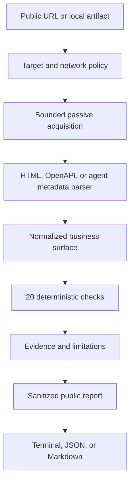

Most businesses say they are ready for AI because they added a chatbot.

Usually, this means the same website now has a small chat bubble that knows six frequently asked questions and becomes strangely philosophical when asked about pricing.

The more interesting question is not whether a business has AI. It is whether an AI agent acting for a customer can discover the business, understand what it offers, use its public interfaces safely, recover when something fails, and provide evidence of what happened.

That question led me to build [Agent Native](https://github.com/revanthpp/agent-native), an open-source scanner for agent-business readiness.

It passively inspects a public URL or local business artifact. It looks for machine-readable interfaces, capability descriptions, authorization rules, transaction safeguards, recovery semantics, observability signals, human escalation paths, and exposed secrets. Then it returns individual findings with evidence and limitations.

No login. No form submissions. No purchases. No mystery score calculated by a model after reading your homepage and feeling generally positive about it.

This is one of my more forward-looking projects because I think the question will become normal: can an agent do business with you, and should it?

## The short version

- A website built for people is not automatically usable by agents.
- An API that developers can call is not automatically safe for autonomous software.
- Agent Native runs 20 deterministic checks across discovery, capability semantics, authorization, transaction safety, recovery, observability, governance, and secret handling.
- Every finding includes a status, explanation, remediation, confidence, and source evidence.
- The scan is passive and bounded. It uses GET requests, does not authenticate, and does not invoke business operations.
- The project deliberately avoids a global readiness score because one severe authorization problem should not disappear inside a pleasant average.
- The current release is a readiness assessment, not a certification or a guarantee of runtime behavior.
- Version 1.0.0 is standard-library-only, open source, and covered by 50 passing tests across unit, integration, security, and evaluation suites.

## What “agent native” means

I do not use “agent native” to mean that every company needs its own branded assistant. The world has enough chat windows already.

An agent-native business publishes enough structured, accurate, and safety-relevant information for external software agents to interact with it responsibly.

That includes a few basic questions:

- Can an agent discover a supported machine interface?
- Are the available operations named and described clearly?
- Are inputs, outputs, authentication methods, and authorization scopes explicit?
- Can the agent distinguish a read from an action that changes state?
- Can it request a quote or preview before a costly commitment?
- Does a mutation support idempotency, cancellation, or compensation?
- Are errors structured well enough to tell a retryable failure from a permanent one?
- Can a request be traced with correlation identifiers?
- Is there a human escalation path when automation cannot finish safely?

These are not speculative protocol details. Most already exist in API design, distributed systems, security engineering, and commerce platforms. Agent Native asks whether the public interface communicates them well enough for agent-mediated use.

The project also avoids inventing a new universal manifest. OpenAPI is the first implemented adapter. MCP, A2A, ordinary HTTP, and future standards can map into the same internal representation. We have plenty of protocols. A new JSON file with a confident name was not the missing ingredient.

## Why an ordinary API is not enough

An API can be technically callable and still be difficult for an agent to use safely.

Consider a `POST /orders` operation. The request schema may be valid. The authentication header may be documented. The endpoint may return a tidy `200` response. That still leaves several important questions unanswered.

Does the operation charge money immediately? Can the customer see a quote first? Is a second identical request treated as a duplicate? Can the order be cancelled? What happens when the server completes the order but the response times out? Which errors should be retried? What should the agent show the person who asked it to place the order?

A developer can investigate those questions, contact support, run tests, and add application-specific handling. An autonomous agent needs explicit semantics and constraints during the interaction. “The endpoint worked in our API client” is useful, but it does not answer whether delegated software should use it without human review.

This difference is why Agent Native separates capability from readiness.

Capability asks whether an operation exists.

Readiness asks whether an agent can understand the operation, receive the correct authority, avoid duplicate or irreversible effects, recover from failure, and preserve evidence for the user.

That is a much less convenient question. Convenient questions already have excellent marketing departments.

## What I built

The core flow is intentionally direct.

The scanner accepts a public URL or a local fixture. For a network target, it validates the URL and resolved addresses before making a request. It fetches a bounded set of likely artifacts, including common OpenAPI locations and agent metadata paths. It parses supported HTML and JSON documents, normalizes the information, runs the check catalog, validates every evidence reference, sanitizes the public report, and renders the result.

Each check is an independent definition with a stable ID from `AR-001` through `AR-020`. A definition includes its domain, version, severity, rationale, evidence requirements, evaluation method, remediation, passive or active boundary, and confidence method.

If one evaluator fails, it returns `ERROR`. The remaining checks still run. One bad artifact should not prevent a useful partial report.

## What the 20 checks measure

The checks are grouped around the conditions an agent needs before it can interact with a business responsibly.

| Area | What Agent Native looks for |
| --- | --- |
| Discovery and interoperability | HTTPS, safe redirects, a discoverable machine interface, and explicit version information |
| Capability semantics | Stable operation identifiers, typed inputs, required fields, and structured outputs |
| Identity and delegated authority | Machine-readable authentication, narrow authorization scopes, and no obvious wildcard access |
| Transaction safety | Structural side-effect classification, quote or preview steps, and confirmation boundaries |
| Reliability and recovery | Idempotency, duplicate suppression, cancellation, compensation, retry guidance, and structured errors |
| Observability and human control | Correlation identifiers, trace support, and a published escalation path |
| Public-interface security | No obvious credentials or secrets in public artifacts and reports |

The checks are conservative. If passive inspection cannot prove a behavior, the scanner uses `NOT_OBSERVED`, `WARN`, or `NOT_APPLICABLE`. It does not convert missing evidence into a flattering assumption.

For example, an OpenAPI document may declare an idempotency header. Agent Native can report that the declaration exists. It cannot prove that the production service actually deduplicates requests correctly. That requires active testing in a verified environment, which the current release does not perform.

This distinction matters. A readiness report should describe the evidence it has, not infer details it could not observe.

## Why the checks are deterministic

I built a project about AI agents and deliberately kept an LLM out of the core scan.

This was not an oversight.

The first release uses deterministic parsing and structural rules because the checks need to be reproducible, explainable, testable, and safe under hostile input. A target page can contain prompt injection text, deceptive instructions, or very enthusiastic claims about its own security. Agent Native treats all of that as data.

The deterministic approach has practical benefits:

- The same static fixture produces the same semantic findings.
- A result can point to the exact artifact and fragment that caused it.
- Security-critical decisions do not depend on model behavior.
- The scanner does not require an API key or an external model call.
- A false positive can become a specific regression test.
- Evaluations can be challenged without debating what a model “probably meant.”

There is room for semantic analysis later. Some business descriptions will always be ambiguous. A future semantic component can help interpret those cases, but it should be optional, non-authoritative, evidence-preserving, and allowed to abstain.

Confidence is useful. Determinism is useful. Pretending they are the same thing is not.

## Why there is no readiness score

Agent Native does not produce a score out of 100.

That decision is deliberate too.

A composite score makes comparison easy, but it can hide the result that matters. A business could publish excellent schemas, clear error responses, detailed retry guidance, and one authorization scope named `admin:*`. Averaging those facts into 84 out of 100 would be mathematically tidy and operationally unhelpful.

Instead, every check reports one of these statuses:

- `PASS`: the expected public signal was found
- `WARN`: the evidence is incomplete or contradictory
- `FAIL`: the signal is missing in a way the check can establish, or a safety condition failed
- `NOT_OBSERVED`: the scan did not find enough evidence
- `NOT_APPLICABLE`: the check does not apply to the observed interface
- `ERROR`: the check could not complete safely

The report also preserves results by domain. A team can see whether the main gaps are in discovery, authorization, transaction safety, recovery, or governance without accepting a single number that suggests all failures are interchangeable.

They are not. Missing a service version and exposing a credential are both findings with very different consequences.

## The security problem inside a readiness scanner

A scanner that reads arbitrary public targets has its own security obligations.

Agent Native treats every target as hostile and every fetched artifact as untrusted data. The network policy rejects credentials embedded in URLs, blocks private and reserved addresses, rechecks DNS resolution before connection, revalidates redirects, limits requests, limits redirects, caps response size, and applies socket timeouts.

The acquisition path uses GET requests only. It does not execute JavaScript, submit forms, authenticate, or call discovered operations. Local fixture reading is handled by a separate fetcher so a network target cannot quietly become a local file path.

The reporting path has another important boundary. Raw artifacts are available internally for parsing and evaluation, but the public report receives only sanitized summaries and bounded evidence fragments. Evidence must match a known artifact ID, URI, type, and content hash. The renderer then validates the final output again before showing or writing it.

This required more work than printing a Python dictionary and calling it observability. It was also necessary.

The security suite covers server-side request forgery controls, redirect validation, DNS rebinding, mapped IPv6 addresses, response limits, timeouts, evidence tampering, terminal control sequences, raw credentials, encoded credentials, double-encoded credentials, URI components, and the public report boundary.

The current repository runs 50 automated tests. An independent hardening review also generated 252 credential variations across keys, encodings, locations, and letter cases. All 252 were detected, sanitized, and blocked from raw report output. The review found a benign documentation phrase that triggered a false positive. That case was fixed and added to the regression suite, which is exactly how a security control should improve.

## Three deliberately simple examples

The repository includes three local reference businesses. They are fixtures, not benchmarks, but they make the progression visible.

| Example | Result profile | What it shows |
| --- | --- | --- |
| Traditional business | 2 passes, 8 signals not observed | A human-readable website can explain the company while publishing very little an agent can use structurally |
| API-enabled business | 11 passes, 2 warnings, 2 signals not observed | An API improves discovery and capability clarity, but side effects, idempotency, retry behavior, and provenance may still be incomplete |
| Agent-native business | 17 passes, no warnings, no missing evidence | A richer interface can publish authorization, transaction, recovery, observability, and support semantics together |

Transport checks are not applicable to local fixtures, so these counts should not be used as public rankings. Their purpose is to test expected changes in evidence as the interface becomes more explicit.

The interesting part is not that the third fixture has more passes. The interesting part is the additional information required to produce those results.

## What the project does not prove

Agent Native is precise about its limits because the limits define the value of the result.

Version 1.0.0 supports JSON OpenAPI documents. YAML and full `$ref` resolution are not implemented yet. MCP and A2A are planned adapters, not current conformance clients. Secret detection is pattern-based. Hosted deployments still need dedicated network egress controls and resource isolation.

Most importantly, passive metadata cannot prove runtime authorization, token validation, object-level access control, idempotency, cancellation, rollback, or actual side effects.

A documented confirmation step may be missing in production. A declared narrow scope may be enforced incorrectly. A cancellation operation may exist and still fail when an order reaches a particular state. The scanner can verify public claims and structural evidence. It cannot replace runtime tests, security review, or production monitoring.

The report is therefore not a certification, legal conclusion, security guarantee, or universal claim that every agent can transact with the business.

It is a readiness profile. Less exciting than a gold badge. Much easier to defend.

## Why I think this matters

More user requests will be handled by software agents. Some will research products. Some will compare services. Some will request quotes, schedule appointments, manage subscriptions, submit claims, or place orders with explicit user approval.

When that happens, a business will have two related interface concerns.

The first is human experience. People still need clear information, accessible pages, understandable terms, and control over decisions.

The second is delegated software access. Agents need structured capabilities, narrow authority, explicit side effects, recovery options, traceable outcomes, and a reliable way to return control to the person.

This does not mean every business should expose every action to agents. The correct answer for some operations will be “not available,” “human approval required,” or “contact support.” Those are valid agent-facing semantics when they are explicit.

I expect agent readiness to become relevant to customer acquisition and operations, not only API engineering. If two businesses offer similar services and one publishes a clear, safe, machine-usable process while the other requires an agent to interpret a changing webpage, the first business is easier for delegated software to use.

Search visibility once pushed businesses to make public information easier for machines to index. Agent-mediated activity adds a different requirement. The machine must not only find the business. It must understand what actions exist, what authority they require, what they change, and how failure is handled.

That is the future I expect Agent Native to support.

## Where I want to take it

The next useful additions are practical:

- YAML OpenAPI and stronger reference resolution
- MCP and A2A adapters mapped into the existing internal model
- Ownership verification for higher-trust assessments
- Verified staging tests for runtime behavior and transaction safety
- Optional semantic checks that remain non-authoritative
- Historical comparisons so teams can see readiness regressions over time
- Better remediation guidance tied to concrete interface changes

I also want the check catalog to remain open to criticism. Stable IDs are useful, but the definitions should evolve when standards change, tests expose weak assumptions, or businesses encounter cases the first release did not anticipate.

The goal is not to declare a permanent definition of an agent-native business. The goal is to make the requirements inspectable enough that builders, businesses, and agent developers can improve them together.

## Final thought

A business can be online, API-enabled, and still be difficult for an agent to use safely.

Agent Native makes that gap visible with passive checks, source evidence, explicit limitations, and remediation guidance. It does not claim to know more than it observed. It does not compress twenty different concerns into one attractive number. It does not perform business actions just to see what happens.

The future may not require every company to build an AI agent. It will require more companies to decide what outside agents are allowed to discover, request, and do.

That interface deserves the same seriousness we already apply to security, reliability, and customer experience.

Preferably before an agent places the same order twice.

  <a href="https://github.com/revanthpp/agent-native" target="_blank" rel="noreferrer">Explore Agent Native on GitHub</a>

