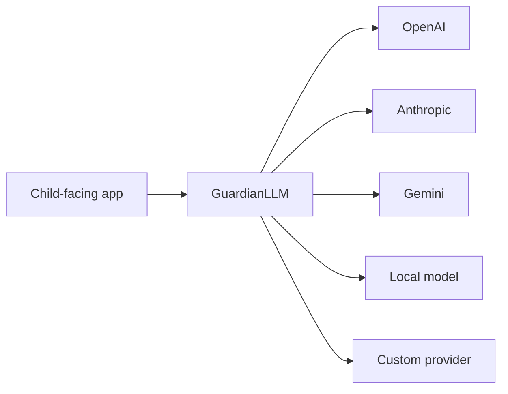
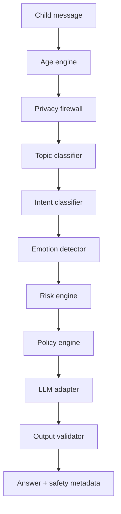

TL;DR

- Child-facing AI needs more than a generic moderation check.
- A seven-year-old, a twelve-year-old, and a sixteen-year-old are not the same product case with different screen sizes.
- `GuardianLLM` sits between a child-facing app and an LLM provider.
- It redacts private information, evaluates age and context, chooses a safety policy, calls the provider, validates the output, and returns explainable metadata.
- The MVP is deterministic, inspectable, and open source. It is not a substitute for legal review, clinical judgment, school policy, parent supervision, or provider safeguards.

## The problem

Most AI safety systems ask one broad question:

> Is this content allowed?

That is useful. It is also incomplete.

For child-facing AI, the better question is:

> Is this interaction appropriate for this child's age, context, and safety needs?

That difference matters.

A younger child asking why people die, a middle-school student dealing with bullying, and an older teen asking about mental health are not the same product scenario. Treating every minor like one vague safety checkbox is convenient for software. Less convenient for actual human development, which remains annoyingly resistant to being compressed into a dropdown.

That is the idea behind [GuardianLLM](https://github.com/revanthpp/guardian-llm): age-aware AI safety middleware for child-facing LLM apps.

Not a chatbot. Not a replacement model. Not a magical "make it safe" sticker for a product roadmap.

A programmable safety layer.

## Why this needs to exist

Child-facing AI is moving from science project to product surface.

AI tutors. Classroom assistants. Learning companions. Smart speaker experiences. Parent-controlled chat apps. Youth wellness tools. Research systems. The category is coming whether the architecture is ready or not, which is usually how technology prefers to arrive: early, confident, and slightly under-supervised.

Kids also disclose things casually.

Names. Schools. Addresses. Passwords. Family situations. Feelings they may not have told anyone else. The chat box feels friendly, so the boundary feels softer than it should.

Raw child input should not be shipped straight to a provider and left to fate, logging policies, and a hopeful product manager with a launch date.

Provider safety systems matter. They should exist. But child-facing products need application-level judgment too: age fit, privacy redaction, family settings, classroom constraints, topic sensitivity, emotional tone, and an explanation of why the system made the decision it made.

"The model said so" is not a debugging strategy. It is barely a sentence.

## What GuardianLLM does

GuardianLLM sits between your application and an LLM provider.



The app sends GuardianLLM a message, age, provider choice, and optional parent policy. GuardianLLM runs the safety pipeline before and after the provider call.

In plain English:

- It maps the child's age to a developmental profile.
- It detects and redacts private information before any provider sees the prompt.
- It classifies topic, intent, and emotional tone.
- It scores risk from `G0_SAFE` to `G4_CRITICAL`.
- It chooses a policy such as `ALLOW`, `SIMPLIFY`, `EDUCATE`, `REDIRECT`, or `TRUSTED_ADULT`.
- It calls the selected provider with a redacted prompt and explicit safety instructions.
- It validates the final answer before returning it to the app.
- It returns metadata so developers can understand what happened.

The goal is not to make AI sterile. The goal is to allow healthy curiosity while protecting privacy, reducing unsafe responses, and making safety decisions understandable.

## Policy before provider

The important architectural choice is where the safety decision happens.



GuardianLLM does not wait until after the model responds to start thinking about safety.

The safety layer evaluates the request first. If the child includes personal information, GuardianLLM redacts it before the provider receives the prompt. If the topic is sensitive, the provider receives safety instructions matched to the child's age profile and risk level. Then the output validator checks the response before the application gets it back.

That gives you layered safety instead of one heroic prompt duct-taped to a production app.

I have nothing against heroic prompts. I simply prefer not to make them the only thing standing between a child and a bad product decision.

## Why start deterministic

The MVP uses deterministic classifiers and policy logic.

That is intentional.

In AI safety, "we used another model to decide" can be useful, but it can also become a fog machine. The first version should be inspectable. A developer should be able to read the rules, understand the risk score, add test cases, and see why a policy fired.

GuardianLLM currently includes:

- Python SDK
- FastAPI API
- Local adapter for offline testing
- Optional OpenAI adapter
- Age profiles
- Privacy firewall
- Topic, intent, and emotion classifiers
- Risk engine
- Policy engine
- Output validator
- ChildSafeBench seed suite
- Unit and API tests
- CI

The deterministic foundation also makes the next layer easier. Later versions can add model-powered classifiers, YAML policy packs, multilingual detection, school modes, provider comparison reports, and benchmark dashboards without turning the core behavior into a shrug.

Boring foundations are underrated. Especially when the product category involves children and production logs.

## What a decision looks like

Every decision returns structured metadata.

```json
{
  "safety_decision": "SIMPLIFY",
  "risk_level": "G1_EDUCATIONAL",
  "triggered_policies": [
    "AGE_8",
    "TOPIC_DEATH",
    "VOCABULARY_LIMIT"
  ],
  "metadata": {
    "response_depth": "low",
    "confidence": 0.8,
    "pii_detected": []
  }
}
```

That metadata matters because safety systems need to be debuggable.

If the system over-refuses, you need to know why. If it under-reacts, you need to know why. If a parent, teacher, product manager, researcher, or engineer asks what happened, the answer cannot be "the moderation endpoint had a feeling."

The point is not just to block. The point is to make better decisions and leave evidence behind.

## What this is not

GuardianLLM is an MVP foundation.

It is not a production child-safety product. It is not legal advice. It is not clinical judgment. It is not school policy. It is not parent supervision. It is not a reason to skip provider-level safeguards.

That boundary is important.

The honest version of child-safe AI is layered: provider protections, application policy, privacy controls, parent or school settings, age-aware response shaping, evaluation, monitoring, and human escalation paths for serious situations.

GuardianLLM is one layer in that stack.

But it is a layer I think more builders will need.

## Where this can go

The next useful version would add policy packs.

Not "safety vibes," but actual versioned policies: parent mode, school mode, teacher mode, strict mode, research mode. Each one should have schema validation, tests, and benchmark cases.

From there:

- richer ChildSafeBench scoring
- conversation-level risk tracking
- multilingual PII detection
- community topic packs
- local-only safety mode
- React policy debugger
- compliance mappings for school procurement and child privacy reviews
- provider comparison reports

The bigger goal is to make developmental safety programmable.

Child-facing AI should not be a generic adult assistant with a smaller vocabulary and a moderation endpoint taped on the side. It should understand age, context, privacy, sensitivity, escalation, and the difference between healthy curiosity and a situation that needs adult support.

That is the shape of the idea.

GuardianLLM is my first pass at building it in public.

<div class="article-cta">
  <a href="https://github.com/revanthpp/guardian-llm" target="_blank" rel="noreferrer">View GuardianLLM on GitHub</a>
</div>
