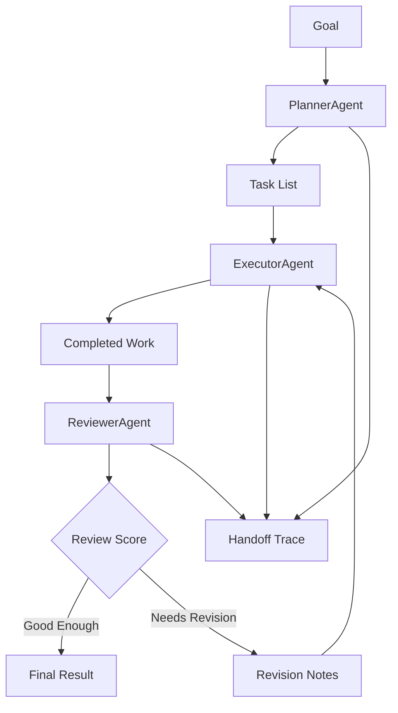

Adding more agents to a workflow does not automatically make it smarter.

Sometimes it just gives you a meeting.

[`multi-agent-planner`](https://github.com/revanthpp/multi-agent-planner) is a small Python project I built to make multi-agent planning feel less mysterious. One goal comes in. A planner breaks it into tasks. An executor does the work. A reviewer checks the result. An orchestrator keeps the state, handoffs, and receipts.

That is the whole idea.

No dramatic agent swarm. No accidental committee meeting. No architecture diagram that looks like it escaped from a cloud vendor keynote and now needs a badge to get back in.

<div className="article-cta">
  <a href="https://github.com/revanthpp/multi-agent-planner" target="_blank" rel="noreferrer">View the GitHub project</a>
</div>

## The problem

A lot of agent demos start with a tempting promise:

Add more agents and the system gets smarter.

Sometimes that is true. Often, it means you now have multiple vague things producing multiple vague outputs while one unlucky orchestrator tries to look calm in public.

Multi-agent planning only becomes useful when each part has a real job:

- the planner breaks the goal into steps
- the executor works through those steps
- the reviewer checks the result
- the orchestrator tracks the workflow

That separation is the lesson.

The agents are not there because three is a magical number. They are there because planning, doing, checking, and coordinating are different responsibilities.

<aside className="callout">
  <h3>Plain English</h3>
  <p>A multi-agent system should not be three chatbots politely interrupting each other. It should be a workflow with clear roles, state, and review.</p>
</aside>

## What I built

`multi-agent-planner` uses three small agents and one orchestrator:

- `PlannerAgent` turns a goal into ordered tasks
- `ExecutorAgent` completes each task
- `ReviewerAgent` scores the output and identifies gaps
- `Orchestrator` moves the workflow forward and records what happened

The default mode is mock mode, so you can run it without an API key.

That mattered to me. A learning project should not require a billing dashboard before the first "hello world." Nothing kills curiosity faster than needing to understand usage tiers before you understand the code.



The system allows one revision cycle when the review score is low. That limit is intentional. Unlimited revision loops sound clever until your agent starts pacing in circles, burning tokens, and calling it "reflection."

## Why this is not just a chatbot

A chatbot gives you an answer.

This gives you a workflow.

You can inspect the generated plan, completed tasks, review score, missing pieces, suggestions, and handoff trace. If something fails, the system says what failed instead of quietly sweeping it under the nearest JSON object.

That is the difference I wanted to highlight: agent systems are not just about generation. They are about responsibility, state, review, and recovery.

The model output is only one artifact. The path to that output matters too.

## What it teaches

This project is for beginner to intermediate developers who know basic Python and APIs but are new to agent orchestration.

It covers:

- task decomposition
- structured workflow state
- planner-executor-reviewer roles
- review thresholds
- bounded revision loops
- handoff traces
- mock-first design
- failure handling

The code is intentionally readable. The goal is not to impress you with abstraction. The goal is to let you open the files and say, "Ah, that is where the handoff happens."

That moment is underrated.

## Failure modes are the good part

The happy path is useful, but it is also a little too well-behaved.

The interesting part is what happens when the planner returns no tasks, the executor fails a task, or the reviewer rejects the result. The orchestrator has to decide what to do next and explain what happened.

That is where agent architecture starts to feel real.

Not in the demo where everything works.

In the moment the plan meets reality, takes one look around, and asks whether there is a manager available.

<aside className="callout">
  <h3>Architecture Note</h3>
  <p>The orchestrator is not decoration. It owns state, sequencing, revision limits, and the trace. Without that layer, multi-agent design turns into group chat with better variable names.</p>
</aside>

## Try it

Clone the project:

```bash
git clone https://github.com/revanthpp/multi-agent-planner
cd multi-agent-planner
python -m venv .venv
source .venv/bin/activate
python -m pip install -e .
python -m multi_agent_planner.main demo
```

Or run your own goal:

```bash
python -m multi_agent_planner.main run --goal "Plan a one-week beginner AI systems learning path"
```

The point is not to build the biggest possible agent system. The point is to build one you can understand.

## Final thought

Multi-agent systems do not need to start big.

Start with one planner, one executor, one reviewer, and a trace you can actually read. Once that makes sense, the bigger patterns stop looking like magic and start looking like software.

Still a little chaotic, of course.

But now with receipts.

<div className="article-cta">
  <a href="https://github.com/revanthpp/multi-agent-planner" target="_blank" rel="noreferrer">Explore multi-agent-planner on GitHub</a>
  <a href="/writing/">Read more writing</a>
</div>
