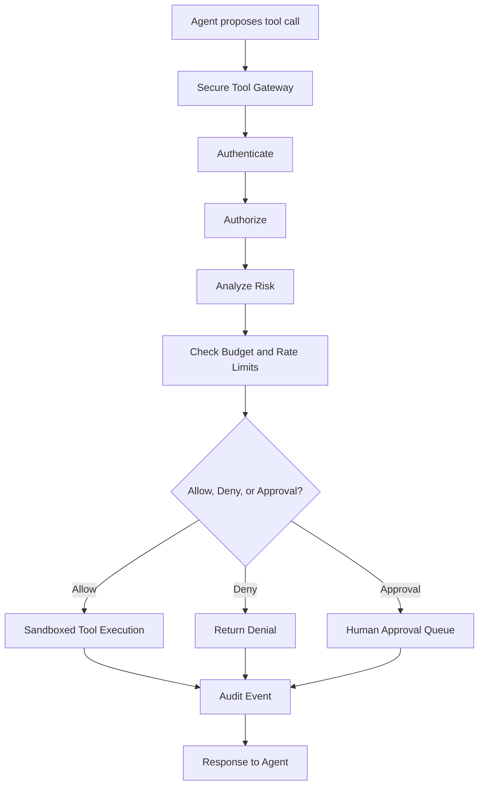
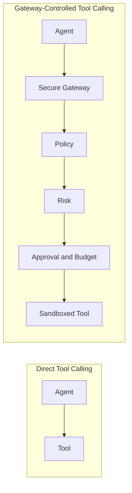

TL;DR

- Direct tool calling is fine for demos, but risky for enterprise workflows.
- A model can propose an action. A system has to authorize it.
- `secure-tool-gateway` puts a policy-driven control plane between agents and tools.
- The MVP checks identity, scopes, roles, risk, budgets, rate limits, approvals, sandbox rules, and audit logs.
- It is a production-style reference implementation, not a production security product.

## The problem

AI agents become useful when they can do things.

They can read files, call APIs, look up CRM records, create tickets, draft emails, query databases, and trigger workflows. That is the promise. It is also the problem.

Once an agent can touch tools, the system is no longer just generating text. It is moving toward action. And action needs control.

The model may decide that calling a tool is the right next step. That does not mean the tool call should happen. It might be the wrong user. The wrong tenant. The wrong scope. The wrong argument. The wrong budget. The wrong risk level. The wrong moment to let software confidently press a button.

Agents should not get API access just because they asked nicely.

## Why direct tool calling breaks down

Most agent demos use direct tool calling because it is easy to understand.

The agent decides it needs a tool. The framework invokes the tool. The result goes back to the agent. The demo works, the room nods, and everyone gets to move on with their afternoon.

But enterprise systems are not demo rooms.

Real systems need to know who requested the action, what they are allowed to do, whether the tool is registered, whether the arguments are safe, whether the call needs approval, whether the agent is looping, whether the tenant is over budget, and whether the whole decision can be investigated later.

That is not a model reasoning problem.

That is a control plane problem.

## Tool calling is a security boundary

A model proposing an action is not the same as a system authorizing that action.

This is the core idea behind [`secure-tool-gateway`](https://github.com/revanthpp/secure-tool-gateway).

The gateway sits between the agent and the tool. The agent sends a structured tool invocation request. The gateway decides whether the request should be allowed, denied, or queued for human approval.

The point is not to make agents less useful. The point is to make useful agents survivable inside real systems.

Autonomy without control is just API access with confidence.

## What I built

`secure-tool-gateway` is a local MVP and production-style reference implementation for secure AI agent tool execution.

It includes:

- FastAPI gateway
- Simulated bearer-token authentication
- Role and scope checks
- Deny-by-default policy decisions
- YAML-driven tool registry
- Deterministic risk analyzer
- Budget and rate-limit checks
- Human approval flow
- Sandboxed mock tools
- SQLite audit logging
- Demo scenarios
- Automated tests
- GitHub Actions CI

The project does not build a chatbot. It builds the security and governance layer around tool invocation.

That distinction matters because a lot of agent demos skip straight to capability. This project starts with the boundary.

## How the gateway works

The main API accepts a structured request with an agent ID, user ID, tenant ID, tool name, arguments, reason, and correlation ID.

The gateway authenticates the bearer token against local demo identities, loads tool metadata from YAML, analyzes arguments for risk, evaluates policy, checks budget and rate limits, and either executes the tool, denies the request, or creates an approval record.

The mock tool registry includes calculators, fake CRM lookup, fake ticket creation, sandboxed file reading, and email draft creation.

The email tool does not send email. It creates a fake draft and requires approval. The file tool only reads from `sandbox_files/`. There is no shell execution and no arbitrary network access.

Good demos make things look easy. Good infrastructure makes the hard parts explicit.

## The controls that matter

Identity comes first.

The MVP uses static bearer tokens for local development. That is not production auth, and it is not pretending to be. In a real deployment, this would become OAuth/OIDC with token verification and proper service identities.

Authorization comes next.

The gateway checks required scopes and allowed roles. A read-only user cannot execute tools. Unknown tools are denied. Disabled tools are denied. Tenant mismatch is denied.

Risk analysis inspects the tool name and arguments.

It detects prompt-injection-like phrases, path traversal attempts, absolute paths outside the sandbox, large payloads, unregistered tools, and sensitive tools such as email and file access.

Budget and rate limits catch another class of failure.

An agent can create damage without being malicious. It can loop. It can retry. It can repeatedly call a tool because the workflow forgot how to stop. The gateway tracks per-user and per-agent rate limits, plus tenant-level daily budget.

Approvals handle sensitive actions.

If a tool requires approval, the gateway creates a pending approval record instead of executing immediately. An admin can approve or deny it. Approved requests execute the original tool call and write a new audit event.

Audit logs tie the system together.

Allowed requests are logged. Denied requests are logged. Approval-required requests are logged. Approved executions are logged. Denied approvals are logged. In many systems, denied behavior is the interesting evidence.

## What this MVP proves

The MVP proves the control pattern, not production completeness.

It shows that tool invocation can be routed through deterministic checks before execution. It shows that a gateway can return structured decisions like `allow`, `deny`, and `requires_approval`. It shows that denied requests can still be first-class audit events. It shows that sensitive tools can pause for approval. It shows that sandbox rules can sit behind policy checks instead of relying on policy alone.

It also shows why this layer should be separate from the model.

The model can be creative. The policy engine should be boring. The model can propose. The system should authorize. Those jobs should not be blurred.

## What production would still need

This is not a production security product.

A real deployment would need:

- OAuth/OIDC and real token verification
- Secrets management
- Strong tenant isolation
- Production database
- Durable budget and rate-limit tracking
- Admin approval UI
- SIEM integration
- OpenTelemetry traces
- Formal threat modeling
- OPA/Rego or an enterprise policy engine
- MCP-compatible tool interface
- Per-tool argument schemas and contract tests
- Hard execution timeouts and isolated workers

Those are the next layers. The MVP is the shape of the argument.

## Final thought

The future of agentic systems will not be decided only by better models.

It will also be decided by the control planes around them: identity, policy, risk, approval, observability, and clear boundaries between proposed action and authorized action.

A model can propose an action. A system has to authorize it.
