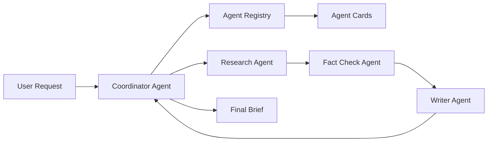
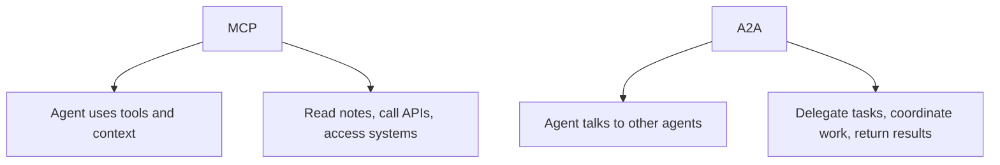

Putting four prompts in one Python file does not automatically create an agent network.

Sometimes it creates four chatbots in a trench coat. They look coordinated until somebody asks who owns the task.

[`a2a-agent-network`](https://github.com/revanthpp/a2a-agent-network) explores the less glamorous, more useful question: how do independent agents find each other and pass work around cleanly?

<aside className="callout">
  <h3>Plain English</h3>
  
MCP is how an agent uses tools. A2A is how agents talk to each other.

</aside>

## What A2A solves

A2A means Agent2Agent.

It describes a way for independently deployed agents to advertise capabilities, accept structured tasks, report status, and return results without sharing all their internal machinery.

Discovery comes first. A coordinator should not send fact-checking work to an agent just because its URL looked trustworthy.

## What I built

This project runs four small Python services:

- a coordinator that discovers specialists and routes work
- a research agent that returns a structured summary and claims
- a fact-check agent that marks claims supported or unsupported
- a writer agent that turns validated claims into a beginner-friendly brief

Each service has its own endpoint, input contract, output contract, and failure boundary. The demo is A2A-inspired and intentionally educational, not a claim of full protocol compliance.

<aside className="callout">
  <h3>Architecture</h3>
  
The coordinator does not pretend to know everything. It finds the right specialist, keeps the task moving, and collects the result.

</aside>

## Agent Cards are business cards

An Agent Card says who the agent is, where it lives, and what it can do. In this project it includes the service name, endpoint, version, capabilities, and short input and output descriptions.

The coordinator reads the cards before delegating. If no agent advertises the needed capability, the workflow stops early instead of sending a mystery package to the wrong porch.

## Tasks need a lifecycle

Work moves through `submitted`, `working`, `completed`, or `failed`.

That may sound like bureaucracy for robots. It is actually how the caller knows whether a result is late, done, or on fire.

Task IDs stay attached to requests and responses so logs can be connected. If a later agent fails, the coordinator returns a partial result, the failed stage, and the safe work completed so far.

## MCP vs A2A

MCP and A2A solve different boundaries. An agent might use MCP to query a database, then use A2A to hand the result to a writer agent.

One helps an agent reach capabilities. The other helps independent agents coordinate.

<aside className="callout">
  <h3>What Can Break</h3>
  
An agent can disappear. A card can advertise the wrong capability. A task can fail halfway through. A retry can repeat work. A coordinator can become the world’s most confident bottleneck.

</aside>

## Failure modes

The demo handles unavailable agents, unsupported capabilities, malformed JSON-RPC requests, failed specialist tasks, and partially completed pipelines.

Production adds harder questions: Who is allowed to advertise a capability? Can the card be trusted? Is a repeated task safe? Where does state survive a restart?

<aside className="callout">
  <h3>Production Notes</h3>
  
Multi-agent design is mostly contract design. Clear inputs, clear status, clear ownership, and clear failure beat a very clever prompt with no receipts.

</aside>

## What I would improve next

I would add authenticated and signed Agent Cards, durable task storage, idempotency keys, retries with limits, streaming updates, and OpenTelemetry traces.

The useful lesson is not that every problem needs more agents. It is that once agents are independent, coordination becomes a real systems problem. A protocol makes that problem visible enough to design.

  <a href="https://github.com/revanthpp/a2a-agent-network" target="_blank" rel="noreferrer">Explore the A2A project</a>
  <a href="/writing/">More FutureProofOS Labs</a>

