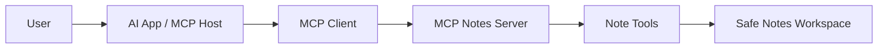
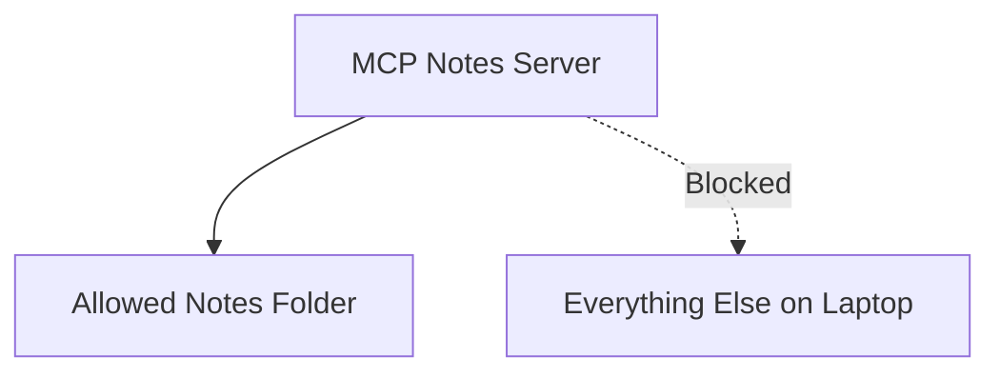

An AI assistant is much more useful when it can read your notes.

It is also much more alarming when “read my notes” quietly becomes “browse my laptop like it pays rent.”

That is the beginner problem behind [`mcp-notes-server`](https://github.com/revanthpp/mcp-notes-server): how do we give an AI useful access without giving it everything?

<aside className="callout">
  <h3>Plain English</h3>
  
MCP is like giving your AI a carefully labeled toolbox instead of handing it the keys to your entire house.

</aside>

## What MCP solves

MCP stands for Model Context Protocol.

In plain English, it gives AI apps a standard way to find and use tools, data, and reusable prompts. The host runs the AI experience. An MCP client connects it to a server. The server advertises what it can do.

That matters because the model should not invent its own path into your files. It should choose from a small menu of known actions with known inputs.

## What I built

This project is a local MCP server for a folder of Markdown notes. An MCP-compatible app can discover five tools:

- list notes
- read one note
- search notes
- create a note
- append to a note

It also exposes a read-only note index and a reusable prompt for summarizing a note.

The server handles the boring parts on purpose: typed inputs, safe filenames, structured results, and a very firm opinion about where files are allowed to live.

<aside className="callout">
  <h3>Architecture</h3>
  
The model does not wander into the filesystem. Every request goes through a small, inspectable server.

</aside>

## How the notes server works

When the server starts, it advertises its tools and their input shapes. The client can see that `read_note` needs a filename, while `search_notes` needs a query.

The model can request a tool. The host decides whether to send that request. The server then validates it before touching a file.

Tool discovery is basically the server saying, “Here is what I can do, and here is the correct paperwork.” Less magical. Much safer.

## The security boundary

The configured notes folder is the boundary. Not the home folder. Not the desktop. Definitely not “let us see what happens.”

Every filename goes through one resolver. It rejects absolute paths, `..` traversal, hidden files, non-Markdown files, and symlinks that escape the workspace.

This is why path boundaries matter. A friendly tool name is not a security control. The code still has to prove that the final path stays inside the allowed folder.

<aside className="callout">
  <h3>What Can Break</h3>
  
A folder can be configured too broadly. A model can choose the wrong tool. Sensitive notes can enter provider logs. Two writes can collide. “Local demo” and “secure remote service” are not the same sentence.

</aside>

## What breaks in production

This is a teaching project, not a tiny Dropbox wearing an MCP badge.

A production version would need identity, per-user permissions, approvals for writes, audit logs with redaction, file limits, locking, encrypted storage, telemetry, and a proper remote transport security model.

It should also run with the least privilege possible. If the process only needs one notes folder, that is all it should get.

<aside className="callout">
  <h3>Production Notes</h3>
  
The model can suggest an action. The system still has to validate and authorize it. Confidence is not a permission slip.

</aside>

## What I would improve next

I would add approval before mutations, atomic writes, a small search index, and clear audit events. I would also make host-side tool activity impossible to miss.

The bigger lesson is simple: useful AI systems need boundaries people can understand. Protocols help with the connection. Good engineering decides what the connection is allowed to do.

  <a href="https://github.com/revanthpp/mcp-notes-server" target="_blank" rel="noreferrer">Explore the MCP project</a>
  <a href="/writing/">More FutureProofOS Labs</a>

